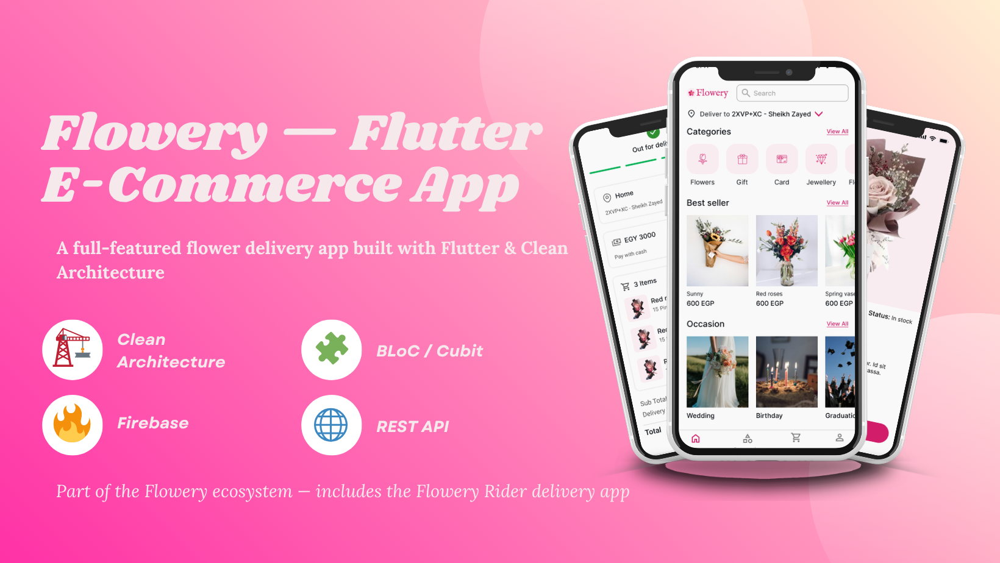
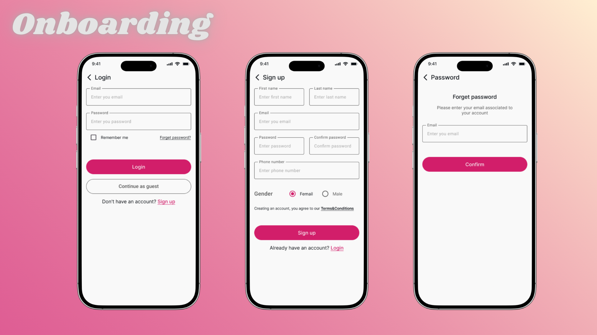
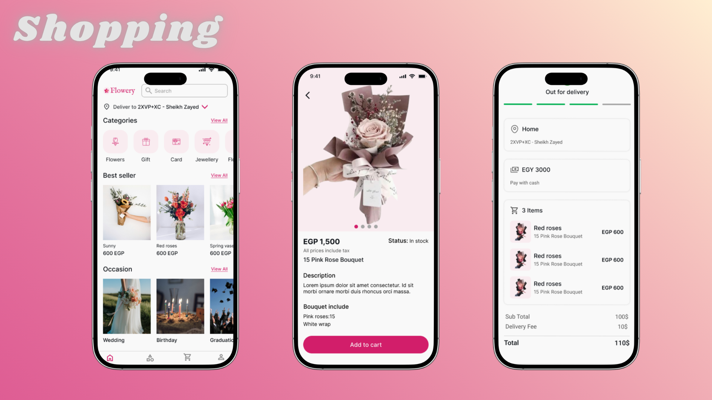

<div align="center">



# Flowery — Flutter E-Commerce App

A full-featured flower delivery mobile application built with Flutter and Clean Architecture.  
Part of the Flowery ecosystem — paired with the [Flowery Rider delivery app](https://github.com/momenhaitham/flowery_rider_application).

[](https://flutter.dev)
[](https://dart.dev)
[](https://firebase.google.com)

</div>

---

## Demo

[](https://drive.google.com/file/d/1yd1WtJ5hG9XYRmgjmOsZhLeLANiPGqYI/view?usp=sharing)

> Click the image above to watch the full demo video (Flowery customer app + Flowery Rider delivery app)

---

## Screenshots

<div align="center">

### Onboarding


### Shopping


### Checkout & Delivery


### Profile & Notifications


</div>

---

## Features

- **Authentication** — Login, registration, remember me, and forgot password with OTP verification
- **Home** — Best sellers, categories, and occasions with dynamic product filtering
- **Product Details** — Full product info, image gallery, and add to cart
- **Search** — Real-time product search across the catalog
- **Cart** — Manage items, update quantities, and view order summary
- **Checkout** — Delivery address selection, cash on delivery and credit card payment via WebView, gift option
- **Order Tracking** — Real-time order status stepper with driver info and live map tracking powered by Firestore
- **Notifications** — In-app notification center with mark as read and clear all
- **Profile** — Update profile, change password, manage saved addresses, order history
- **Localization** — Full Arabic and English support with RTL layout
- **Offline resilience** — Token management with secure storage and connectivity handling

---

## Architecture

This project follows **Clean Architecture** with a feature-first folder structure.

```
lib/
└── app/
    ├── config/          # DI, base state, interceptors, local storage
    ├── core/            # Routes, theme, endpoints, shared widgets
    └── feature/         # 21 feature modules
        ├── auth/
        ├── home/
        ├── product_details/
        ├── cart/
        ├── check_out/
        ├── orders/
        ├── notifications/
        ├── profile/
        └── ...
```

Each feature is divided into three layers:

| Layer | Responsibility |
|-------|---------------|
| **Data** | DTOs, Retrofit API clients, remote data sources, repository implementations |
| **Domain** | Entities, repository contracts, use cases |
| **Presentation** | Screens, widgets, Cubit/ViewModel, states, events |

---

## Tech Stack

| Category | Technology |
|----------|-----------|
| Framework | Flutter 3.x |
| Language | Dart 3.x |
| State Management | flutter_bloc (Cubit + MVI pattern) |
| Dependency Injection | get_it + injectable |
| Networking | Dio + Retrofit + pretty_dio_logger |
| Serialization | json_annotation + dart_mappable |
| Local Storage | shared_preferences + flutter_secure_storage |
| Backend | Firebase Core, Crashlytics, Messaging, Cloud Firestore |
| Maps | flutter_map + Firestore real-time updates |
| UI | flutter_screenutil + google_fonts + cached_network_image |
| Localization | Flutter l10n (EN + AR) |
| Testing | flutter_test + mockito |

---

## API

Base URL: `https://flower.elevateegy.com/api/v1`

Key endpoints used across the app:

| Feature | Endpoint |
|---------|---------|
| Auth | `/auth/login` · `/auth/signup` · `/auth/forgotPassword` |
| Products | `/products` · `/products/:id` |
| Categories | `/categories` |
| Occasions | `/occasions` |
| Cart | `/cart` |
| Orders | `/orders` |
| Checkout | `/orders/cashOnDelivery` · `/orders/creditCard` |
| Notifications | `/notifications/user` · `/notifications/mark-read` |
| Profile | `/users/profile` · `/users/changePassword` |
| Addresses | `/addresses` |

---

## Getting Started

### Prerequisites

- Flutter SDK `>=3.0.0`
- Dart SDK `>=3.0.0`
- Android Studio / Xcode
- Firebase project configured

### Installation

```bash
# Clone the repository
git clone https://github.com/AhmedYousef72/e_commerce_app.git
cd e_commerce_app

# Switch to the main development branch
git checkout temp_develop

# Install dependencies
flutter pub get

# Run code generation
dart run build_runner build --delete-conflicting-outputs

# Run the app
flutter run
```

---

## Project Structure

```
lib/
├── app/
│   ├── config/
│   │   ├── di/                  # GetIt + Injectable setup
│   │   ├── base_response/       # BaseResponse (Success/Error)
│   │   ├── base_state/          # CustomCubit base class
│   │   └── local_storage/       # Token & preferences use cases
│   ├── core/
│   │   ├── routes/              # Named routes + RouteGenerator
│   │   ├── endpoint/            # AppEndPoint constants
│   │   ├── theme/               # AppColors, AppTheme
│   │   └── widgets/             # Shared UI components
│   └── feature/
│       ├── start/               # App bootstrap + language init
│       ├── splash/              # Splash → login/home routing
│       ├── auth/                # Login
│       ├── signup/              # Registration
│       ├── forget_password/     # OTP + reset password flow
│       ├── home/                # Shell + bottom nav
│       ├── categories/          # Category browsing
│       ├── search/              # Product search
│       ├── best_seller/         # Best sellers list
│       ├── occasion/            # Occasions + products
│       ├── product_details/     # Product detail + add to cart
│       ├── check_out/           # Checkout + payment
│       ├── address/             # Saved addresses
│       ├── address_details/     # Add/edit address
│       ├── orders/              # Order history
│       ├── track_order_stepper/ # Order status + driver info
│       ├── map_flowery_app/     # Live map tracking (Firestore)
│       ├── notifications/       # In-app notifications
│       ├── profile/             # Profile management
│       ├── about_app/           # About screen
│       ├── terms_and_conditions/
│       └── success_page_flowery_app/
├── l10n/                        # AR + EN localization files
└── main.dart
```

---

## The Flowery Ecosystem

This app is one half of a complete flower delivery platform:

| App | Description | Repo |
|-----|-------------|------|
| **Flowery** (this repo) | Customer app — browse, order, and track flower deliveries | [e_commerce_app](https://github.com/AhmedYousef72/e_commerce_app) |
| **Flowery Rider** | Driver app — receive orders, navigate, and update delivery status | [flowery_rider_application](https://github.com/momenhaitham/flowery_rider_application) |

Both apps communicate in real time via **Cloud Firestore** for live order tracking.

---

## Team

| Name | GitHub |
|------|--------|
| Islam Ramzy | [@IslamRamzy444](https://github.com/IslamRamzy444) |
| Momen Haitham | [@momenhaitham](https://github.com/momenhaitham) |
| Sayed Alfeki | [@sayedalfeki](https://github.com/sayedalfeki) |
| Ahmed Yousef | [@AhmedYousef72](https://github.com/AhmedYousef72) |

---

## My Contribution

I implemented 4 features end-to-end following Clean Architecture (data → domain → presentation):

### 🌸 Occasion Screen — `feature/occasion-screen` · PR #7
- Built the full occasion browsing screen with dynamic product filtering by occasion
- Refactored from scratch to Cubit/MVI pattern + Retrofit after PR review feedback
- Resolved multiple merge conflicts with the develop branch

### 🔍 Search Screen — `feature/search-screen` · PR #35
- Implemented real-time product search feature with live API integration
- Handled PR review feedback and resolved conflicts with develop branch

### 📦 Orders Screen — `feature/TEAM-60-orders-screen` · PR #39
- Built orders screen with active and completed tabs
- Added all orders API endpoints to the app endpoint constants
- Resolved merge conflicts including categories view model test fixes

### 🔔 Notifications Screen — `feature/TEAM-61-notifications-screen` · PR #41
- Implemented full notifications feature (data → domain → presentation)
- Integrated 5 API endpoints: get, unread count, mark read, mark all read, clear all
- Built `NotificationsViewModel` using Cubit + MVI pattern
- Wired navigation from Profile screen to Notifications screen
- Added unit tests for the notifications view model
- Added localization keys in EN and AR

---

<div align="center">

Made by Ahmed Yousef ✨😊
</div>
